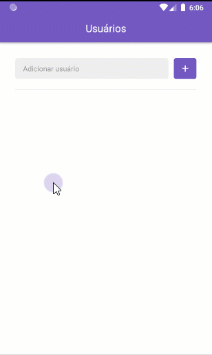

<h1 align="center">
    
</h1>

<p align="center">
  

  <a href="https://rocketseat.com.br">
    
  </a>

  

  <a href="https://github.com/Rocketseat/bootcamp-gostack-desafio-06/stargazers">
    
  </a>
</p>

# Desafio 6: Projeto com React Native

Desenvolvimento de um app para busca de Repositórios e Favoritos através da API do GitHub.

## :rocket: Sobre o desafio

Nesse desafio foi adicionado novas funcionalidades na aplicação que foi desenvolvido ao longo do módulo.

### Funcionalidades

#### 1. Loading de repositórios

Foi adicionado um indicator de loading utilizando `<ActivityIndicator />` antes de carregar a lista de repositórios favoritados na tela de detalhes do Usuário.

#### 2. Scroll infinito

Foi adicionado uma funcionalidade de scroll infinito na lista de repositórios favoritados. Assim que o usuário chegar nos **20%** do final de lista, buscamos pelos items na próxima página e adicionamos na lista. O código ficou da seguinte forma:

```js
<Stars
  onEndReachedThreshold={0.2} // Carrega mais itens quando chegar em 20% do fim
  onEndReached={this.loadMore} // Função que carrega mais itens
  // Restante das props
>
```

Para requisitar uma nova página no Github foi utilizado um parâmetro `page` no fim da URL:

```
https://api.github.com/users/diego3g/starred?page=2
```

#### 3. Pull to Refresh

Foi adicionado uma funcionalidade para quando o usuário arrastar a listagem de repositórios favoritados pra baixo, atualizar a lista resetando o estado, ou seja, voltando o estado da paginação para a página 1 exibindo apenas os 30 primeiros itens.

A funcionalidade "Pull to Refresh" existe por padrão na FlatList e pode ser implementada através do seguinte código:

```js
<Stars
  onRefresh={this.refreshList} // Função dispara quando o usuário arrasta a lista pra baixo
  refreshing={this.state.refreshing} // Variável que armazena um estado true/false que representa se a lista está atualizando
  // Restante das props
>
```

#### 4. WebView

Foi criado uma nova página na aplicação que vai ser acessada quando o usuário clicar em um repositório favoritado, essa página contem apenas o Header da aplicação. O conteúdo da página será uma WebView, ou seja, um browser integrado que exibe o atributo `html_url` presente no objeto do repositório que vem da API do Github.

Documentação de utilização da [WebView](https://github.com/react-native-community/react-native-webview/blob/master/docs/Getting-Started.md).

Exemplo de código:

```js
<WebView source={{ uri: repository.html_url }} style={{ flex: 1 }} />
```

### Aplicação


